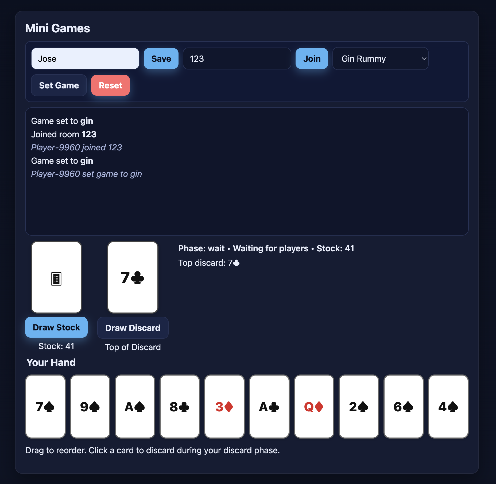

# Online Mini-Games 🎮



A tiny full-stack playground featuring **Guess the Letter**, **Tic-Tac-Toe**, and a two-player **Gin Rummy (MVP)** — built with **Node.js**, **Express**, and **Socket.IO**.  
Real-time rooms, draggable card ordering, and a clean UI that’s easy to share with employers.

> Live demo: https://online-minigames.onrender.com/
> Repo: https://github.com/jfalconi-cavallini/online_minigames

---

## Features

- **Rooms:** Join by room code (e.g. `lobby`) to play with friends.
- **Guess the Letter:** Simple warm-up multiplayer mini-game.
- **Tic-Tac-Toe:** 2-player, server-validated turns & win/draw detection.
- **Gin Rummy (MVP):**
  - Server deals a standard deck and tracks stock/discard.
  - **“Gone Gin” detection**: checks 10-card hands for a 3/3/4 partition of valid melds (runs or sets).
  - **Draw from Stock/Discard**, discard to end turn.
  - **Private hands** via `ginPrivate` Socket.IO channel.
  - **Draggable hand** (client-side reordering) with correct discard mapping.
  - Big, **readable card tiles** above draw buttons (no image assets required).

---

## Tech Stack

- **Backend:** Node.js, Express, Socket.IO
- **Frontend:** Vanilla JS + CSS (no build step)
- **Deploy:** Render / Railway / Heroku (any Node host works)

---

## Quick Start (Local)

```bash
# 1) Clone and install
git clone https://github.com/jfalconi-cavallini/online_minigames.git
cd online_minigames
npm install

# 2) Start the server
npm start
# Server listens on PORT (defaults to 3000)

# 3) Open the app
# http://localhost:3000
```
